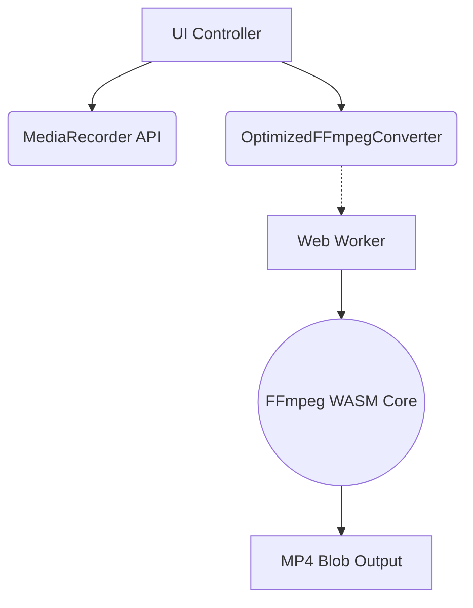

<div align="center">
  
  <h1>🎙️ Impromptu Speech & Transcoder API</h1>
  <p>A front-end solution for WebRTC-based video recording and WebM-to-MP4 transcoding.</p>
</div>

## ✨ Features

- **Client-Side Transcoding**: Utilizes WebAssembly (WASM) via `@ffmpeg/ffmpeg` to transcode video directly in the browser, eliminating the need for server-side processing.
- **Web Worker Integration**: Audio/Video transcoding is a CPU-intensive task. The FFmpeg core is offloaded into a dedicated Web Worker (`ffmpeg-worker.js`), ensuring the main UI thread remains responsive.
- **GitHub Pages Compatible**: Advanced WASM typically requires `SharedArrayBuffer` (and strict CORS headers). This project implements an optimized conversion pipeline (`ffmpeg-converter-optimized.js`) that safely bypasses this requirement, guaranteeing compatibility with standard static hosting environments.
- **Modular API**: The core transcoding logic is decoupled from the UI, designed to be imported and reused in other WebRTC or MediaRecorder projects.

## 🏗️ Architecture



## 💻 API Usage

This repository exposes an optimized `FFmpeg` converter that can be integrated into existing media projects:

```javascript
import OptimizedFFmpegConverter from './modules/ffmpeg-converter-optimized.js';

// 1. Initialize the converter (Auto-spawns Web Worker)
const converter = new OptimizedFFmpegConverter(true);

// 2. Attach Progress Listeners
converter.onProgress = (percent) => console.log(`Converting: ${percent}%`);

// 3. Execute Transcoding (from WebM Blob to MP4 ArrayBuffer)
await converter.init();
const mp4Buffer = await converter.convertWebMToMP4(webmBlob);

// 4. Handle Output
const mp4Blob = new Blob([mp4Buffer], { type: 'video/mp4' });
```

## 🚀 Installation & Development

This project uses **Vite** for local development and optimized builds.

```bash
# 1. Install dependencies
npm install

# 2. Start local development server
npm run dev

# 3. Build for production
npm run build
```

## 📄 License
MIT License.
